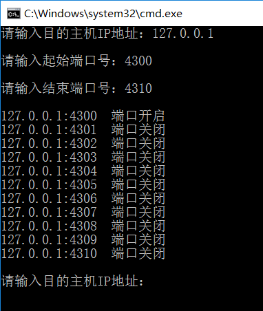

一、 实验目的
        了解端口扫描的基本概念和工作原理
        编写一个利用全连接的端口扫描程序，能显示目标主机的端口开放情况。要求能在命令行输入要扫描的目标主机和端口范围。比如：scan  *.*.*.*   nnnn-mmmm
二、实验设计
        （一）实验内容：
        编写一个利用全连接的端口扫描程序，能显示目标主机的端口开放情况。要求能在命令行输入要扫描的目标主机和端口范围。比如：scan  *.*.*.*   nnnn-mmmm
        （二）背景知识
        端口扫描原理
        在“计算机网络”课程中，我们知道完成一次TCP连接需要完成三次握手才能建立。端口扫描正是利用了这个原理，通过假冒正常的连接过程，依次向目标主机的各个端口发送连接请求，并根据目标主机的应答情况判断目标主机端口的开放情况，从而分析并对一些重要端口实施攻击。
        端口扫描的方式有两种，一种称为完整扫描，另一种扫描方式称为半开扫描，出于欺骗的目的，半开扫描在收到服务端的应答信号（SYN+ACK）后，不再发送响应信号（ACK）。
（三）实验设计
        1、字符串处理
        实验要求的输入格式是：scan  *.*.*.*   nnnn-mmmm，但考虑到使用及程序复杂性，所以微微调整输入目的主机及端口号范围的表达方式，详细见实验结果截图。
        2、设计主程序
        （1）WinSock编程框架；
        （2）输入目的IP地址以及端口范围；
        （3）设置获取的用户输入IP地址为远程IP地址；
        （4）从开始端口到结束端口依次扫描，每扫描一个端口创建一个新的套接字；
        （5）设置远程地址信息中的端口号为需要扫描的当前端口号；
        （6）连接到当前端口号的目的地址；
        （7）若连接成功（ connect（）函数返回0 ）则输出该端口为开启状态，否则输出该端口为关闭状态；
        （8）关闭当前套接字。
三、实验过程
（一） 实验结果
 1、cmd命令（netstat –a -n）查看本地端口开放情况
 2、测试（测试结果可对比图2查看是否正确）
        测试情况1：仅在初始化时候创建套接字
		
		测试情况2：每扫描一个端口重新创建一个新的套接字
	
	（二）测试结果总结分析
        每次扫描端口都要使用新的套接字，上次扫描的套接字在使用完之后应该关闭，避免套接字与端口保持连接而致使端口被占用，无法扫描其他端口。
四、讨论与分析
        1、 阐述全连接扫描的原理。
        全连接扫描是TCP端口扫描的基础，现有的全连接扫描有TCP connect()扫描和TCP反向ident扫描等。其中TCP connect()扫描的实现原理如下所述：扫描主机通过TCP/IP协议的三次握手与目标主机的指定端口建立一次完整的连接。连接由系统调用connect开始。如果端口开放，则连接将建立成功；否则，若返回-1则表示端口关闭。
        建立连接成功：响应扫描主机的SYN/ACK连接请求，这一响应表明目标端口处于监听(打开)的状态。如果目标端口处于关闭状态，则目标主机会向扫描主机发送RST的响应。
        2、 你的程序是否考虑了扫描效率？如没有考虑你准备如何改进？
        我的程序使用的全连接扫描，没有考虑扫描效率。考虑从以下两方面改进：
        （1）使用半连接扫描，若端口扫描没有完成一个完整的TCP连接，在扫描主机和目标主机的一指定端口建立连接时候只完成了前两次握手，在第三步时，扫描主机中断了本次连接，使连接没有完全建立起来，这样的端口扫描称为半连接扫描，也称为间接扫描。使用这种连接的优点在于即使日志中对扫描有所记录，但是尝试进行连接的记录也要比全扫描少得多，从而提高了扫描效率。
        （2）建立多个线程同时扫描，加快速度。
        3、 主程序设计思路
        （1）WinSock编程框架；
        （2）输入目的IP地址以及端口范围；
        （3）设置获取的用户输入IP地址为远程IP地址；
        （4）从开始端口到结束端口依次扫描，每扫描一个端口创建一个新的套接字；
        （5）设置远程地址信息中的端口号为需要扫描的当前端口号；
        （6）连接到当前端口号的目的地址；
        （7）若连接成功（ connect（）函数返回0 ）则输出该端口为开启状态，否则输出该端口为关闭状态；
        （8）关闭当前套接字。
        4、 connect（）函数的使用
        Connect（）函数用于建立到socket的连接，该socket必须处于监听状态。本次实验扫描端口是否开放的原理是模拟TCP建立连接的过程，用connect（）函数依次连接目的主机端口，若函数调用成功，即connect（）函数返回0，则表示该端口处于监听状态，为开放的端口，否则该端口处于关闭状态。
五、总结
        本实验最主要是使用函数Connect（）函数，用该函数去建立连接，如果连接成功，说明该端口处于打开状态，如果没有连接成功说明端口处于关闭状态。每次扫描端口都要使用新的套接字，上次扫描的套接字在使用完之后应该关闭，避免套接字与端口保持连接而致使端口被占用，无法扫描其他端口。